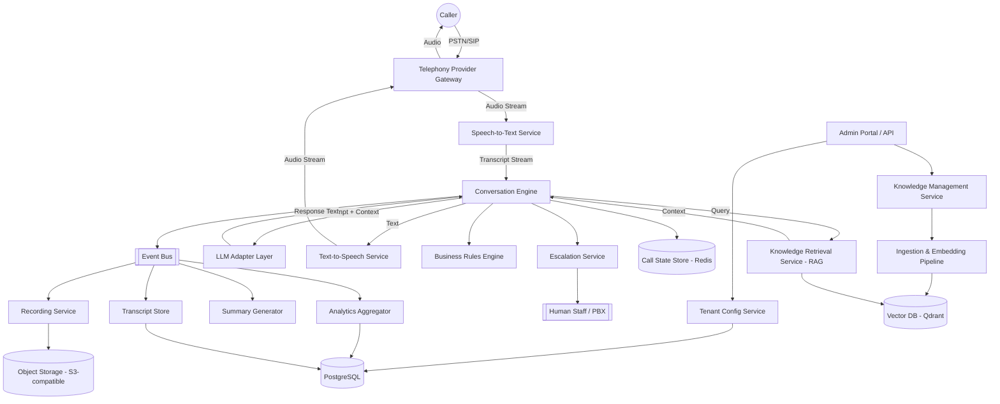
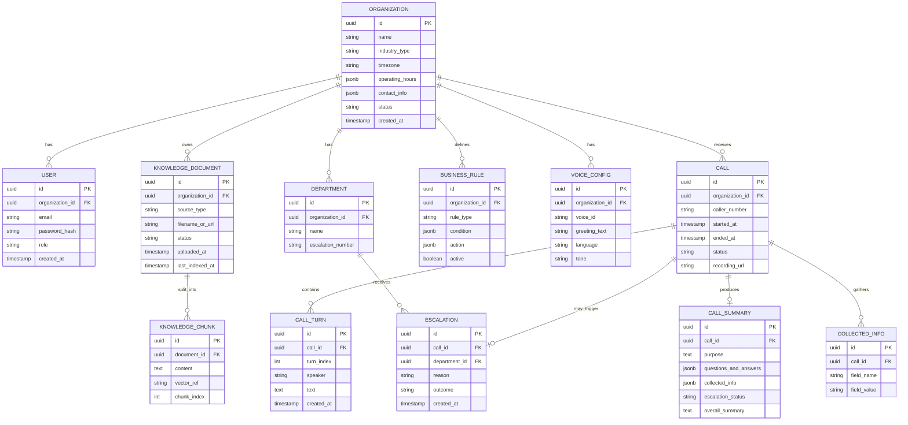

# Architecture.md — Enterprise AI Voice Receptionist Platform

> Companion to `PRD.md`. This document is the technical single source of truth for system design.

---

## 1. High-Level Architecture



## 2. System Components

| Component | Responsibility |
|---|---|
| **Telephony Gateway Adapter** | Abstracts the telephony provider (SIP/PSTN bridging, call control, media streaming). |
| **Speech-to-Text (STT) Service** | Streaming transcription of caller audio. Provider-agnostic adapter (Whisper, Deepgram). |
| **Conversation Engine** | Core orchestrator. Owns call state, turn management, intent detection, tool routing, escalation decisions, interruption handling. The LLM is a subordinate reasoning tool it calls — never the controller. |
| **LLM Adapter Layer** | Uniform interface over OpenAI/Gemini/Claude for reasoning and response generation; supports function/tool calling and structured outputs. |
| **Knowledge Retrieval Service (RAG)** | Embeds queries, performs vector search scoped to the tenant, returns ranked context chunks with source citations and confidence scores. |
| **Ingestion & Embedding Pipeline** | Parses uploaded documents (PDF/DOCX/TXT/MD/CSV/XLSX/JSON/URLs), chunks, embeds, writes to the tenant's vector namespace; re-indexes on update/delete. |
| **Embedding Adapter** | Swappable interface (`libs/embedding_adapters`) to interact with models like OpenAI `text-embedding-3-small`. |
| **Document Parser Adapter** | Swappable interface (`libs/document_parsers`) parsing documents into chunkable text formats. |
| **Business Rules Engine** | Tenant-configured rules: escalation triggers, operating hours, department routing, data-collection requirements. Declarative, not hardcoded per tenant. |
| **Escalation Service** | Executes transfer logic (warm/cold), notifies human staff, packages call summary for handoff. |
| **Text-to-Speech (TTS) Service** | Converts engine output text to streamed audio. Provider-agnostic adapter (OpenAI TTS, ElevenLabs). |
| **Call State Store (Redis)** | Ephemeral, low-latency per-call context (conversation turns, collected slots, current intent) for the duration of a call. |
| **Event Bus** | Publishes call lifecycle events (call started/ended, turn completed, escalation triggered) consumed by Recording, Transcript, Summary, and Analytics services asynchronously. |
| **Recording Service** | Captures and stores call audio in object storage, tied to tenant consent configuration. |
| **Transcript Store** | Persists full transcripts (structured, turn-by-turn) in PostgreSQL. |
| **Summary Generator** | Post-call LLM-assisted structured summary (purpose, Q&A, collected data, escalation outcome). |
| **Analytics Aggregator** | Computes and stores rollups (volume, duration, transfer rate, unanswered-question rate, FAQ frequency). |
| **Tenant Config Service** | CRUD for organization profile, hours, departments, contacts, voice settings, escalation numbers, business rules. |
| **Knowledge Management Service** | Admin-facing API for uploading/editing/removing knowledge sources; triggers ingestion pipeline. |
| **Admin Portal (Web App)** | UI for org admins/platform operators: configuration, knowledge upload, call history, analytics dashboards. |
| **Auth Service** | Authentication/authorization for admin portal and APIs (tenant-scoped RBAC). |
| **API Gateway** | Single entry point for all external API traffic; handles routing, rate limiting, auth token validation. |

## 3. Folder Structure (Assumption — proposed monorepo layout)

```
ai-receptionist-platform/
├── apps/
│   ├── admin-portal/                # Frontend web app (React/Next.js — see Design.md)
│   └── voice-runtime/                # Real-time call handling process(es)
├── services/
│   ├── conversation_engine/
│   │   ├── domain/                   # Entities, value objects, business rules (DDD)
│   │   ├── application/              # Use cases / orchestration
│   │   ├── infrastructure/           # Adapters: telephony, STT, TTS, LLM, DB
│   │   └── interfaces/               # API/event handlers
│   ├── knowledge_service/
│   │   ├── domain/
│   │   ├── application/
│   │   ├── infrastructure/           # Vector DB adapter, document parsers
│   │   └── interfaces/
│   ├── tenant_config_service/
│   ├── escalation_service/
│   ├── recording_service/
│   ├── analytics_service/
│   ├── auth_service/                  # Auth and JWT token issuance
│   └── shared_kernel/                 # Shared domain types, DTOs, event schemas
├── libs/
│   ├── llm-adapters/                  # OpenAI / Gemini / Claude adapters, common interface
│   ├── stt-adapters/                  # Whisper / Deepgram adapters
│   ├── tts-adapters/                  # OpenAI TTS / ElevenLabs adapters
│   ├── telephony-adapters/            # Provider-specific call control adapters
│   ├── embedding_adapters/            # OpenAI Embedding adapters
│   ├── document_parsers/              # LangChain parsers (PDF, TXT, etc.)
│   ├── event-bus-client/
│   └── common-utils/
├── infra/
│   ├── docker/
│   ├── docker-compose.yml
│   ├── nginx/
│   └── ci-cd/
├── docs/                               # This documentation set
└── tests/
    ├── unit/
    ├── integration/
    └── e2e/
```

> **Assumption:** A modular monolith-leaning microservice split is proposed (each `services/*` deployable independently but developed in one repo). See Open Questions in `PRD.md` regarding team size, which affects whether a monorepo or polyrepo is preferable.

## 4. Technology Stack

| Layer | Choice | Notes |
|---|---|---|
| Backend language/framework | Python + FastAPI | Async-first, ideal for streaming I/O with STT/TTS/LLM |
| ORM | SQLAlchemy | With Alembic for migrations |
| Primary datastore | PostgreSQL | Tenant config, transcripts, analytics, metadata |
| Cache / ephemeral state | Redis | Per-call state, session data, rate limiting |
| Vector database | Qdrant | Per-tenant payload filtering (logical isolation) |
| Embeddings | OpenAI text-embedding-3-small | Exposed via swappable adapter interface |
| LLM providers | OpenAI / Gemini / Claude via adapter interface | Swappable per tenant or globally |
| STT | Whisper or Deepgram | Adapter interface |
| TTS | OpenAI TTS or ElevenLabs | Adapter interface |
| Telephony | Provider TBD (Assumption: Twilio-class) | Adapter interface |
| Object storage | S3-compatible | Call recordings, uploaded documents |
| Containerization | Docker, Docker Compose | Local dev + baseline deployment |
| Reverse proxy | Nginx | TLS termination, routing |
| Frontend (Admin Portal) | React (Next.js recommended — Assumption) | See `Design.md` |
| Messaging/Event Bus | Redis Streams (MVP) → Kafka/RabbitMQ (scale) | Assumption: start simple, graduate under load |
| Observability | OpenTelemetry + Prometheus/Grafana + structured JSON logs | Assumption |

## 5. Database Schema (Core Entities)



> **Note:** Vector embeddings themselves are stored in Qdrant, not PostgreSQL; `KNOWLEDGE_CHUNK.vector_ref` is a pointer/ID into the vector store. The actual retrieval response returns the joined chunk content along with `confidence_score` (raw cosine similarity) and `is_confident` (boolean threshold comparison).

## 6. API Design (Representative — not exhaustive)

All APIs are versioned (`/api/v1/...`), tenant-scoped by auth context, and follow REST conventions. Internal real-time call events use the Event Bus rather than REST.

| Method | Endpoint | Purpose |
|---|---|---|
| `POST` | `/api/v1/organizations` | Create a new tenant (platform operator only) |
| `GET` | `/api/v1/organizations/{id}` | Fetch org profile/config |
| `PUT` | `/api/v1/organizations/{id}` | Update org profile (hours, contacts, departments) |
| `POST` | `/api/v1/organizations/{id}/knowledge` | Upload a knowledge document |
| `GET` | `/api/v1/organizations/{id}/knowledge` | List knowledge documents + indexing status |
| `DELETE` | `/api/v1/organizations/{id}/knowledge/{docId}` | Remove a document (triggers re-index) |
| `PUT` | `/api/v1/organizations/{id}/voice-config` | Configure greeting, voice, language, tone |
| `POST` | `/api/v1/organizations/{id}/business-rules` | Create/update an escalation or routing rule |
| `GET` | `/api/v1/organizations/{id}/calls` | List call history (filterable) |
| `GET` | `/api/v1/organizations/{id}/calls/{callId}` | Call detail: transcript, summary, recording link |
| `GET` | `/api/v1/organizations/{id}/analytics` | Aggregated analytics for a date range |
| `POST` | `/internal/telephony/webhook` | Inbound call event from telephony provider (not tenant-scoped directly; resolved via phone number → org mapping) |
| `POST` | `/internal/conversation/turn` | Internal engine-to-LLM-adapter turn processing (service-to-service) |
| `POST` | `/api/v1/auth/login` | Authenticate user credentials and generate custom JWT token |
| `POST` | `/api/v1/organizations/{id}/retrieval` | Query Qdrant vector store and return contextual chunks with `confidence_score` and `is_confident` flags |

## 7. Authentication

- Admin Portal / API: **OAuth2 / JWT bearer tokens**, issued by the Auth Service.
- Platform Operators: separate elevated role with cross-tenant access, enforced at the API Gateway.
- Telephony webhooks: verified via provider-specific signature validation (e.g., request signing) rather than JWT.
- Service-to-service internal calls: mTLS or signed internal tokens within the private network (Assumption).

## 8. Authorization

Role-Based Access Control (RBAC), tenant-scoped:

| Role | Scope | Permissions |
|---|---|---|
| Platform Operator | Cross-tenant | Manage tenants, billing, global settings |
| Org Owner/Admin | Single tenant | Full config, knowledge, users, analytics for their org |
| Org Staff (Escalation Recipient) | Single tenant, limited | View calls routed to their department, view summaries |
| Read-only Analyst | Single tenant | View analytics/dashboards only |

All data-access queries must include an org/tenant filter at the repository layer — never trust a client-supplied tenant ID alone without cross-checking against the authenticated principal's tenant membership.

## 9. State Management

- **Per-call ephemeral state** (conversation turns, current intent, collected slots, retrieval context) lives in Redis, keyed by `call_id`, TTL'd shortly after call end.
- **Durable state** (transcripts, summaries, config, analytics) is persisted to PostgreSQL after/during the call via the Event Bus, decoupled from the real-time path so persistence latency never blocks the live conversation.
- The Conversation Engine is designed to be **stateless at the process level** — all state is externalized to Redis/Postgres — so engine instances can scale horizontally and a call can, in principle, survive a process restart (future resiliency goal).

## 10. Caching Strategy

- Tenant configuration (hours, rules, voice config) cached in Redis with short TTL + explicit invalidation on config update, to avoid a DB hit on every turn.
- Frequently retrieved knowledge chunks/answers may be cached per-tenant (careful invalidation on document update/delete).
- Common TTS phrases (greetings, standard hold/transfer lines) pre-synthesized and cached as audio to reduce latency and cost.

## 11. Error Handling

- All services return structured errors (`error_code`, `message`, `trace_id`).
- The Conversation Engine must **never crash a live call** on a downstream failure (LLM timeout, retrieval failure, TTS failure): it falls back to a safe scripted response ("I'm having trouble accessing that information — let me connect you with someone who can help") and triggers escalation if the failure persists.
- Circuit breakers around external provider calls (LLM, STT, TTS, telephony) with graceful degradation paths.
- All failures are logged with correlation IDs tying together `call_id`, `org_id`, and `trace_id`.

## 12. Logging

- Structured JSON logs across all services.
- Every log line includes: `timestamp`, `service`, `org_id`, `call_id` (if applicable), `trace_id`, `level`, `message`.
- Sensitive data (raw caller PII, full transcripts) logged only to secured, access-controlled sinks — never to general-purpose application logs.

## 13. Monitoring

- **Metrics:** call volume, STT/TTS/LLM latency percentiles, escalation rate, error rate per provider adapter, vector search latency.
- **Tracing:** distributed tracing (OpenTelemetry) across the full pipeline (Telephony → STT → Engine → Retrieval → LLM → TTS) per call.
- **Alerting:** provider outage detection, latency SLO breaches, abnormal escalation-rate spikes (may indicate a knowledge gap or model regression).
- **Dashboards:** per-tenant and platform-wide views (Grafana — Assumption).

## 14. Deployment Strategy

- Containerized services (Docker), orchestrated initially via Docker Compose for early stages, with a documented migration path to Kubernetes as scale demands (Assumption — see `Phases.md`).
- Environments: `dev`, `staging`, `production`, strictly isolated data stores.
- Blue/green or rolling deployments for the Conversation Engine and voice-runtime processes to avoid dropping active calls (Assumption).
- Nginx as the ingress/reverse proxy with HTTPS termination (cert automation, e.g., Let's Encrypt — Assumption).

## 15. CI/CD

- Pipeline stages: lint → unit tests → build → integration tests → security scan → deploy to staging → manual approval → deploy to production.
- Each service independently deployable; changes to `libs/` trigger dependent-service test runs.
- Infrastructure-as-code for environment provisioning (Assumption: Terraform, not yet decided — see Open Questions in `PRD.md`).

## 16. Security Considerations

- Tenant data isolation is purely **logical** (application-layer `organization_id` payload filtering on every query across both PostgreSQL and Qdrant) rather than physical separate namespaces/collections, optimizing for a large volume of small tenants without excessive overhead.
- Encryption at rest for PostgreSQL, object storage, and vector DB; encryption in transit (TLS) everywhere.
- PII minimization: only collect caller data explicitly required by the receptionist role.
- Secrets management via a dedicated secrets store (not `.env` files in production — Assumption: Vault or cloud-native secrets manager).
- Rate limiting and abuse detection at the API Gateway and on the telephony webhook endpoint.
- Regular dependency and container vulnerability scanning in CI.

## 17. Scalability Plan

- Stateless service design allows horizontal scaling of the Conversation Engine and API services behind a load balancer.
- Redis and PostgreSQL scaled independently (read replicas for Postgres as analytics load grows).
- Vector DB (Qdrant) scaled via sharded/replicated collections, with tenant isolation enforced via payload filtering.
- Telephony concurrency handled via the provider's native scaling (adapter should support call queuing/backpressure).
- Event Bus decouples real-time call handling from downstream processing (recording, summary, analytics), allowing those to scale/queue independently under load.

## 18. Performance Considerations

- Streaming everywhere possible: STT streams partial transcripts, LLM streams partial tokens, TTS streams partial audio — minimizing perceived latency.
- Pre-fetch/pre-cache tenant config and common greeting audio before the call is even answered when feasible.
- Vector search tuned for top-k relevance with tenant-scoped indexes to avoid scanning irrelevant data.
- Avoid synchronous chains where async/event-driven processing suffices (e.g., recording upload, summary generation happen post-call, asynchronously).

## 19. Open Questions (Architecture-specific)

- AQ-1: Kubernetes vs. Docker Compose/Swarm as the production orchestration target, and at what tenant/call-volume threshold does the migration happen?
- AQ-2: Exact telephony provider and whether warm transfer (SIP REFER / conference bridging) is supported by the chosen provider.
- AQ-3: Event Bus technology at scale (Redis Streams vs. Kafka vs. RabbitMQ) — dependent on expected throughput.
- AQ-4: Secrets management tooling.
- AQ-5: Multi-region deployment requirements (data residency per tenant jurisdiction)?
