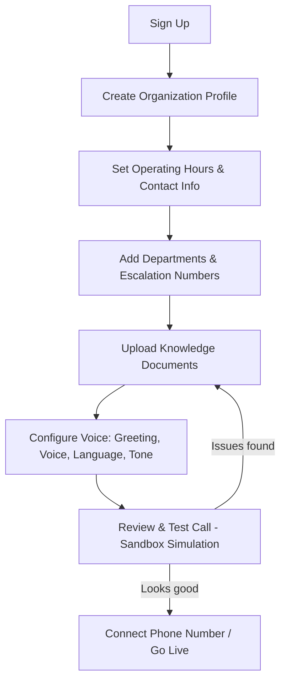
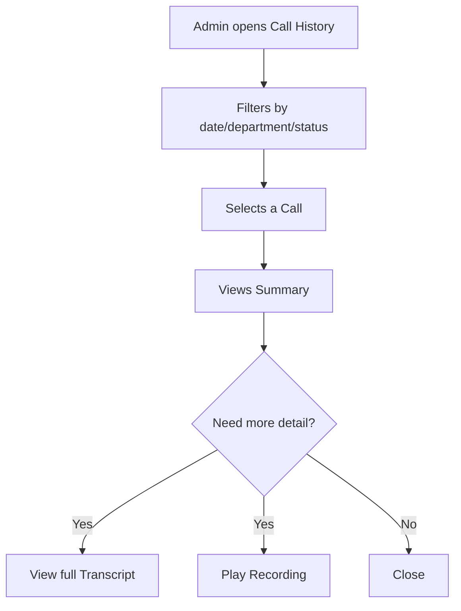
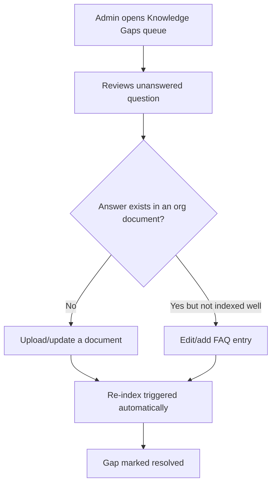

# Design.md — Product & UX Design

> Covers the **Admin Portal** (the only graphical surface in this platform — the receptionist itself is voice-only and has no visual UI). Voice interaction design ("conversation design") is covered separately in §11.

---

## 1. Design Principles

1. **Clarity over cleverness.** Org admins are often non-technical; every screen should be understandable without training.
2. **Configuration-first.** The UI's job is to make "teach the AI about your organization" feel as easy as filling out a form, not writing code.
3. **Trust through transparency.** Always show *why* the AI said something (source citation, confidence) and *what* it doesn't know (knowledge gaps).
4. **Calm, professional tone.** This is enterprise software for receptionists' employers — avoid playful/gimmicky UI; favor clean, business-appropriate design.
5. **Progressive disclosure.** Advanced configuration (business rules, escalation logic) is available but not forced on a first-time admin during onboarding.

## 2. User Experience Goals

- An admin can go from signup to a working, tested AI receptionist in under an hour.
- An admin can understand, at a glance, how their receptionist performed this week (calls, transfers, gaps).
- An admin never has to touch code, JSON, or a developer to make a change.
- Escalation staff can find what they need (summary, reason, transcript) in one click from a notification.

## 3. User Flows

### 3.1 Onboarding Flow



### 3.2 Call Review Flow



### 3.3 Knowledge Gap Resolution Flow



## 4. Information Architecture

```
Admin Portal
├── Dashboard (analytics overview)
├── Organization Setup
│   ├── Profile & Hours
│   ├── Departments & Escalation
│   └── Voice & Greeting
├── Knowledge Base
│   ├── Documents (upload/list/status)
│   ├── FAQs
│   └── Knowledge Gaps
├── Business Rules
├── Calls
│   ├── Call History (list)
│   └── Call Detail (summary/transcript/recording)
├── Analytics
│   ├── Overview
│   ├── FAQ Frequency
│   └── Escalation Trends
├── Users & Roles (org team members)
└── Account / Billing (platform-level)
```

## 5. Navigation

- Primary navigation: left sidebar, persistent, icon + label, grouped per the Information Architecture above.
- Top bar: organization switcher (for platform operators / multi-org admins), user menu, notifications (e.g., new knowledge gaps, failed indexing).
- Breadcrumbs on nested detail pages (e.g., Calls → Call Detail).

## 6. Screen / Page Inventory

| Screen | Purpose | Primary Users |
|---|---|---|
| Sign Up / Login | Auth entry point | All |
| Onboarding Wizard | Guided first-time setup | Org Admin |
| Dashboard | At-a-glance metrics + alerts | Org Admin, Business Owner |
| Organization Profile | Edit name, hours, contact info | Org Admin |
| Departments & Escalation | Manage departments and transfer numbers | Org Admin |
| Voice & Greeting Config | Set voice, language, greeting text, tone | Org Admin |
| Knowledge Documents | Upload/list/delete/re-index documents | Org Admin |
| FAQs | Manage structured Q&A pairs directly | Org Admin |
| Knowledge Gaps | Review unanswered questions, resolve | Org Admin |
| Business Rules | Configure escalation/routing rules | Org Admin |
| Call History | List/filter past calls | Org Admin, Staff |
| Call Detail | Summary, transcript, recording playback | Org Admin, Staff |
| Analytics Overview | Charts: volume, duration, transfer rate | Org Admin, Business Owner |
| Users & Roles | Invite/manage team members, assign roles | Org Admin |
| Sandbox / Test Call | Simulate a call in-browser before going live | Org Admin |
| Platform Admin Console | Cross-tenant management (separate app or gated section) | Platform Operator |

## 7. Layout Guidelines

- 12-column responsive grid for the Admin Portal.
- Max content width ~1200px on large screens, centered, with the sidebar fixed.
- Cards used for grouped, scannable data (e.g., a knowledge document card showing name, type, status, last-indexed time).
- Tables used for list views with sort/filter (Call History, Documents, Users).
- Forms grouped into logical sections with clear section headers, not one long unbroken form (relevant to Onboarding and Organization Profile).

## 8. Component Library

Core reusable components (build once, reuse everywhere):

- Button (primary/secondary/destructive/ghost variants)
- Input, Textarea, Select, Toggle, Time Picker (for hours), File Upload (drag-and-drop)
- Table (sortable, filterable, paginated)
- Card
- Badge/Tag (for status: `Indexed`, `Processing`, `Failed`, `Escalated`, `Resolved`)
- Modal / Dialog
- Toast/Notification
- Tabs
- Stepper (used in Onboarding Wizard)
- Audio Player (for call recording playback, with waveform — Assumption)
- Chart components (line, bar — for Analytics)
- Empty State illustration + message
- Confidence/Source Citation chip (shown next to AI answers in transcripts, e.g. "Source: Pricing.pdf, p.2")

> **Decision:** React (Next.js) + Tailwind CSS + shadcn/ui components, rather than adopting a heavy pre-built admin template, to keep the brand distinct.

## 9. Typography

| Role | Assumption |
|---|---|
| Primary typeface | A clean, modern sans-serif (e.g., Inter or system-ui stack) — final choice open |
| Headings | Semi-bold, clear size hierarchy (H1 → H4) |
| Body | Regular weight, minimum 14px base size for readability in data-dense tables |
| Monospace | Used only for technical/debug views (e.g., raw event logs), not customer-facing |

## 10. Color Palette (Assumption — placeholder tokens, brand TBD)

| Token | Usage | Example |
|---|---|---|
| `--color-primary` | Primary actions, links, active nav | Deep blue (#1E4FBB — placeholder) |
| `--color-secondary` | Secondary accents | Slate teal (#2D9CA6 — placeholder) |
| `--color-success` | Indexed, resolved, healthy states | Green (#1E9E5A) |
| `--color-warning` | Processing, low-confidence | Amber (#D98C0E) |
| `--color-danger` | Failed, escalated-urgent | Red (#D6403F) |
| `--color-neutral-900..50` | Text/background scale | Gray scale |

> Actual brand colors are an open decision — see Open Questions.

## 11. Voice / Conversation Design (No Visual UI)

Since the receptionist itself is voice-only, "design" here means conversational design standards, not visual design:

- **Greeting:** Configurable per tenant but must always include: organization name, AI identification (should not pretend to be human when directly asked — transparency requirement), and an open-ended prompt ("How can I help you today?").
- **Turn-taking:** Support natural interruption (barge-in); do not force callers to wait through a full response before speaking.
- **Uncertainty language:** Standardized phrasing bank for "I don't have that information — let me connect you with someone who can help," never an invented answer.
- **Escalation language:** Always apologize briefly, state the transfer is happening, and (if warm transfer available) confirm the caller will not need to repeat themselves.
- **Data collection tone:** Ask one piece of information at a time, framed naturally within context, never as a rapid-fire form-like interrogation.
- **Closing:** Polite, brief sign-off confirming next steps if any (e.g., "You'll be transferred to our front desk now" / "Thanks for calling, have a great day").

## 12. Responsive Behavior

- Admin Portal: fully responsive down to tablet width (≥768px) as a baseline; full mobile-phone optimization is a stretch goal, not MVP (Assumption — admins are expected to primarily configure from desktop).
- Call History/Detail and Dashboard views should have a reasonable simplified mobile view for on-the-go monitoring.

## 13. Accessibility Considerations

- WCAG 2.1 AA baseline (per `Rules.md` §13).
- All status indicators (Indexed/Failed/Escalated) paired with text/icon, not color alone.
- Audio player for recordings includes a text transcript alternative (already required functionally, doubles as an accessibility feature).
- Form validation errors announced accessibly (ARIA live regions) and shown inline, not only via toast.

## 14. Empty States

| Screen | Empty State Message (example) |
|---|---|
| Knowledge Documents | "No documents yet. Upload your first document to start teaching your AI receptionist about your organization." |
| Call History | "No calls yet. Once your receptionist is live, calls will appear here." |
| Knowledge Gaps | "No unanswered questions right now — nice work keeping your knowledge base current." |
| Business Rules | "No custom rules yet. Your receptionist is using default escalation behavior." |

## 15. Error States

- Document upload failure: show reason (unsupported format, size limit, parsing error) with a retry action, never a generic "something went wrong."
- Indexing failure: document card shows `Failed` badge with an expandable reason and a re-index button.
- Call data load failure: inline error with retry, distinguishing "no data" from "failed to load."

## 16. Loading States

- Skeleton loaders for tables/cards (Call History, Documents, Analytics charts) rather than blank screens or spinners alone.
- Document processing shows a `Processing` badge with indeterminate progress until indexing completes (webhook/poll-driven status update).

## 17. Design Tokens (Illustrative Structure)

```json
{
  "color": {
    "primary": "#1E4FBB",
    "secondary": "#2D9CA6",
    "success": "#1E9E5A",
    "warning": "#D98C0E",
    "danger": "#D6403F"
  },
  "spacing": {
    "xs": "4px",
    "sm": "8px",
    "md": "16px",
    "lg": "24px",
    "xl": "40px"
  },
  "radius": {
    "sm": "4px",
    "md": "8px",
    "lg": "16px"
  },
  "typography": {
    "fontFamily": "Inter, system-ui, sans-serif",
    "baseSize": "14px",
    "headingWeight": 600,
    "bodyWeight": 400
  }
}
```

## 18. Open Questions

- DQ-1: Final brand identity (logo, exact color palette, typeface) — not yet defined.
- DQ-2: Is a native mobile app needed for admins, or is responsive web sufficient indefinitely?
- DQ-3: Should the Platform Operator console be a separate application or a gated section of the same Admin Portal?
- DQ-4: Is real-time call monitoring (listen to a call as it happens) an MVP requirement or a future feature?
