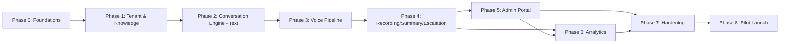

# Phases.md — Implementation Roadmap

> Sequential, practical breakdown of building the platform. Each phase builds only on what the previous phase delivered. Complexity is rated Low / Medium / High / Very High.

---

## Phase 0 — Foundations & Project Scaffolding

**Objective:** Establish the repository, architecture skeleton, and shared conventions so every later phase has a consistent base.

**Deliverables:**
- Monorepo scaffolded per `Architecture.md` §3 folder structure.
- Docker Compose environment (Postgres, Redis, FAISS/Qdrant dev instance).
- CI pipeline skeleton (lint, test, build stages).
- `shared-kernel` with core domain types (Organization, Call, KnowledgeDocument stubs).
- Base FastAPI service template with health-check endpoint, structured logging, OpenTelemetry wiring.

**Dependencies:** None.

**Acceptance Criteria:**
- `docker-compose up` brings up all core infra services locally.
- CI runs lint + a placeholder test on every PR.
- A "hello world" FastAPI service is deployable via the documented pipeline.

**Risks:** Over-engineering the skeleton before requirements are validated.

**Estimated Complexity:** Low

**Milestones/Tasks:**
- [ ] Initialize monorepo structure.
- [ ] Set up Docker Compose for Postgres/Redis/vector DB.
- [ ] Set up base FastAPI service template + logging + tracing.
- [ ] Set up CI (lint/test/build).
- [ ] Define shared domain types in `shared-kernel`.

---

## Phase 1 — Tenant & Knowledge Foundation (No Voice Yet)

**Objective:** Build multi-tenant configuration and the knowledge ingestion/RAG pipeline as text-only, testable via API — before adding voice complexity.

**Deliverables:**
- `tenant-config-service`: CRUD for Organization, Department, VoiceConfig, BusinessRule.
- `knowledge-service`: document upload (PDF/DOCX/TXT/MD/CSV/XLSX/JSON), parsing, chunking, embedding, indexing into per-tenant vector namespace.
- Retrieval API: given a text query + org_id, return ranked grounded chunks with confidence scores.
- Auth Service: basic org admin authentication (JWT).

**Dependencies:** Phase 0.

**Acceptance Criteria:**
- An admin can create an organization via API, upload a PDF, and query it, receiving grounded, cited chunks.
- Queries with no relevant knowledge return a clear "no confident match" result rather than fabricated content.
- Tenant data isolation verified: org A cannot retrieve org B's knowledge under any query.

**Risks:** Parsing quality for varied document formats; embedding cost/latency at scale.

**Estimated Complexity:** Medium

**Milestones/Tasks:**
- [ ] Design and migrate core schema (Organization, Department, KnowledgeDocument, BusinessRule, VoiceConfig).
- [ ] Build document parsers for each supported format.
- [ ] Build chunking + embedding pipeline.
- [ ] Integrate FAISS (dev) with per-tenant namespace isolation.
- [ ] Build retrieval API with confidence scoring.
- [ ] Build tenant-scoped auth (JWT, RBAC roles per `Architecture.md` §8).
- [ ] Write isolation tests (cross-tenant leakage checks).

---

## Phase 2 — Conversation Engine (Text-Mode First)

**Objective:** Build the Conversation Engine's control logic — intent detection, retrieval invocation, business rules, escalation decisions, data collection — operating over **text** turns (no voice yet), to validate the "brain" before adding real-time audio complexity.

**Deliverables:**
- `conversation-engine` service with domain model for Call, CallTurn, Intent, EscalationDecision.
- LLM Adapter Layer (OpenAI/Gemini/Claude) with tool-calling for: `retrieve_knowledge`, `collect_caller_info`, `trigger_escalation`, `end_call`.
- Business Rules Engine evaluating tenant-configured escalation/routing rules.
- A simple text-based simulation harness (chat-style) to test full conversations end-to-end without telephony.

**Dependencies:** Phase 1.

**Acceptance Criteria:**
- Simulated text conversations correctly retrieve grounded answers, collect defined caller fields naturally, and escalate per configured rules.
- The LLM cannot directly cause a side effect without going through an Engine-validated tool call.
- Low-confidence retrieval reliably triggers a graceful fallback/escalation path, verified by adversarial test cases.

**Risks:** Over-fitting conversation design to one org's style before generalization is proven; LLM tool-calling reliability.

**Estimated Complexity:** High

**Milestones/Tasks:**
- [ ] Define Call/CallTurn/Intent domain model.
- [ ] Build LLM adapter interface + at least one provider implementation.
- [ ] Implement tool-calling contract (retrieve_knowledge, collect_caller_info, trigger_escalation, end_call).
- [ ] Implement Business Rules Engine (hours, escalation triggers, routing).
- [ ] Build Redis-backed call state store.
- [ ] Build text-mode simulation harness + test conversation suite.
- [ ] Implement graceful-degradation fallback behavior for downstream failures.

---

## Phase 3 — Voice Pipeline Integration

**Objective:** Attach real-time speech I/O (STT + TTS + Telephony) to the validated Conversation Engine.

**Deliverables:**
- STT adapter (streaming) integrated into the live call path.
- TTS adapter (streaming) integrated into the live call path.
- Telephony Gateway Adapter: inbound call handling, audio streaming both directions, call control (answer/transfer/hangup).
- Interruption/barge-in handling.
- Pre-cached common TTS phrases (greeting, hold, transfer).

**Dependencies:** Phase 2.

**Acceptance Criteria:**
- A real phone call to a test number is answered, greeted, can ask a knowledge-based question, gets a spoken grounded answer, and can request a human transfer, all within target latency (`PRD.md` NFRs).
- Interrupting the AI mid-response correctly stops TTS playback and re-engages listening.
- A downstream provider failure mid-call degrades to a scripted safe response instead of dropping the call silently.

**Risks:** Real-world latency and telephony reliability; provider-specific quirks; interruption handling complexity.

**Estimated Complexity:** Very High

**Milestones/Tasks:**
- [ ] Integrate telephony provider inbound webhook + media streaming.
- [ ] Integrate streaming STT into the live pipeline.
- [ ] Integrate streaming TTS into the live pipeline.
- [ ] Implement barge-in/interruption handling in the Engine.
- [ ] Implement warm/cold transfer execution via telephony adapter.
- [ ] Load-test call concurrency handling.
- [ ] End-to-end real call QA across at least 3 pilot tenant configurations.

---

## Phase 4 — Recording, Transcripts, Summaries, Escalation Handoff

**Objective:** Complete the post-call data pipeline: durable recording, transcript persistence, structured summaries, and full escalation handoff packaging.

**Deliverables:**
- Recording Service storing audio to object storage with tenant consent configuration respected.
- Transcript Store persisting turn-by-turn transcripts to PostgreSQL.
- Summary Generator producing structured summaries (purpose, Q&A, collected info, escalation outcome) post-call.
- Escalation Service fully wired: notification to human staff with summary context.
- Event Bus wiring for all of the above, decoupled from the live call path.

**Dependencies:** Phase 3.

**Acceptance Criteria:**
- Every completed call has a recording (if tenant opted in), a full transcript, and a generated summary within a defined post-call SLA (e.g., < 60s — Assumption).
- Escalated calls result in a human receiving both the live transfer and the structured summary.
- Recording/consent behavior correctly varies per tenant configuration.

**Risks:** Legal/consent correctness across jurisdictions; summary quality/accuracy.

**Estimated Complexity:** Medium

**Milestones/Tasks:**
- [ ] Implement Event Bus (Redis Streams MVP).
- [ ] Build Recording Service + object storage integration + consent logic.
- [ ] Build Transcript Store persistence from call events.
- [ ] Build Summary Generator (LLM-assisted, structured output).
- [ ] Complete Escalation Service handoff packaging + human notification channel.
- [ ] Build "unanswered questions" knowledge-gap logging.

---

## Phase 5 — Admin Portal (Configuration, Knowledge, Call History)

**Objective:** Give non-technical org admins a UI to configure their receptionist and review calls, replacing raw API usage.

**Deliverables:**
- Org onboarding flow (profile, hours, departments, escalation numbers, voice config).
- Knowledge upload/management UI with indexing status.
- Business rules configuration UI.
- Call history list + detail view (transcript, summary, recording playback).
- Basic role-based access (Owner/Admin/Staff/Analyst) in the UI.

**Dependencies:** Phases 1, 4 (needs config + call data APIs).

**Acceptance Criteria:**
- A non-technical admin can complete tenant onboarding (profile → knowledge upload → live receptionist) in under the target time from `PRD.md` §11 without engineering help.
- Admin can review any call's transcript/summary/recording from the portal.

**Risks:** UX complexity for non-technical users; scope creep into "just one more admin feature."

**Estimated Complexity:** High

**Milestones/Tasks:**
- [ ] Set up frontend app scaffold per `Design.md`.
- [ ] Build onboarding wizard flow.
- [ ] Build knowledge management screens.
- [ ] Build business rules configuration screens.
- [ ] Build call history list/detail screens.
- [ ] Implement RBAC-aware navigation/permissions in the UI.

---

## Phase 6 — Analytics Dashboard

**Objective:** Provide the metrics defined in `PRD.md` §11 to org admins and business owners.

**Deliverables:**
- Analytics Aggregator computing rollups (volume, duration, transfer rate, unanswered-question rate, FAQ frequency, trends).
- Dashboard UI with charts and filters (date range, department).

**Dependencies:** Phase 4 (data), Phase 5 (portal shell).

**Acceptance Criteria:**
- Dashboard reflects accurate, near-real-time (or documented refresh interval) metrics matching underlying call data.

**Risks:** Aggregation performance at scale; metric definitions ambiguity (must match `PRD.md` §11 exactly).

**Estimated Complexity:** Medium

**Milestones/Tasks:**
- [ ] Build Analytics Aggregator service/jobs.
- [ ] Define and implement each metric per `PRD.md` §11.
- [ ] Build dashboard UI with charts.
- [ ] Add knowledge-gap review view (unanswered questions → admin action).

---

## Phase 7 — Hardening: Security, Scale, Multi-Tenant QA

**Objective:** Production-hardening pass before broad rollout.

**Deliverables:**
- Full tenant-isolation security audit (DB, vector store, object storage, logs).
- Load testing for concurrent multi-tenant call volume.
- Secrets management migration to production-grade tooling.
- Alerting/monitoring dashboards fully wired per `Architecture.md` §13.
- Disaster recovery / backup procedures documented and tested.

**Dependencies:** All prior phases functionally complete.

**Acceptance Criteria:**
- Penetration/isolation testing finds no cross-tenant data leakage.
- System sustains target concurrent call load (target TBD — see Open Questions) without SLO breach.
- Backup/restore procedure verified via a drill.

**Risks:** Discovering architecture gaps late; cost of retrofitting security controls.

**Estimated Complexity:** High

**Milestones/Tasks:**
- [ ] Conduct tenant-isolation security audit.
- [ ] Run load/concurrency tests, document results.
- [ ] Migrate secrets to production secrets manager.
- [ ] Finalize monitoring/alerting dashboards.
- [ ] Document and drill backup/restore + incident response.

---

## Phase 8 — Pilot Launch & Feedback Loop

**Objective:** Launch with a small number of real pilot organizations across different industries to validate organization-independence claims.

**Deliverables:**
- 3–5 pilot tenants onboarded across different industries (per `PRD.md` §6 personas).
- Feedback collection mechanism (admin-reported issues, knowledge-gap review cadence).
- Post-pilot retrospective updating `Memory.md` and `PRD.md` with learnings.

**Dependencies:** Phase 7.

**Acceptance Criteria:**
- Pilot tenants successfully operate the receptionist without any org-specific code changes.
- Success metrics from `PRD.md` §11 are measured and reviewed for each pilot.

**Risks:** Real-world edge cases (accents, background noise, ambiguous requests) not covered in testing.

**Estimated Complexity:** Medium

**Milestones/Tasks:**
- [ ] Recruit/select pilot organizations across distinct industries.
- [ ] Onboard each pilot via the Admin Portal (Phase 5) with no engineering involvement.
- [ ] Monitor calls, collect feedback, track knowledge gaps.
- [ ] Conduct retrospective; update documentation set with findings.

---

## Phase Sequencing Summary

## Open Questions

- PQ-1: What target concurrent-call load should Phase 7 be tested against?
- PQ-2: What is the acceptable post-call SLA for summary/transcript availability (assumed 60s in Phase 4 — needs confirmation)?
- PQ-3: How many pilot organizations, and from which industries specifically, for Phase 8?
